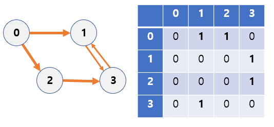
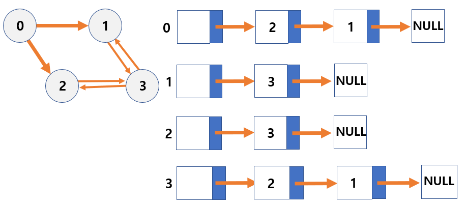

## 그래프의 구현

<h3> 순차 자료구조를 이용한 그래프의 구현 : 인접 행렬Adjacent Matrix</h3>

- 행렬에 대한 2차원 배열을 사용하는 순차 자료구조 방법
- 인접 행렬에 그래프의 간선 정보를 저장한다.
  - N개의 정점을 가진 그래프 = `N x N 정방 행렬`
  - 행렬의 행 번호와 열 번호 = 그래프의 정점
  - 행렬 값 = 두 정점이 인접되어있으면 1, 인접되어있지 않으면 0
- 간선 (i, j)가 존재한다면 `[i][j] = 1`이고, 존재하지 않으면 `[i][j] = 0`이다.

- 무방향 그래프의 인접 행렬
  - 행렬 i의 합 = 열 i의 합 = 정점 i의 차수
- 방향 그래프의 인접 행렬
  - 행 i의 합=  정점 i의 진출 차수
  - 열 i의 합 = 정점 i의 진입차수

 

<h3> 인접 행렬의 장단점 </h3>

- 장점
  - 두 노드의 간선 정보를 확인하는 것이 빠르다. O(1)
  - 새로운 간선을 추가하고 제거하는 것이 빠르다. O(1)
- 단점
  - 간선의 개수와 상관없이 배열의 크기는 항상 N * N개이다. O(N2) (N = 노드의 개수) 
  - 특정한 노드에 인접한 노드를 찾기 위해서 모든 노드를 순회해야 한다.
  - 노드를 추가하거나 제거하는데 오래 걸린다. O(N2)
  - 그래프의 모든 간선의 수를 찾는데 오래걸린다. O(N2)
- 따라서 인접 행렬은 상대적으로 노드의 개수가 적고 간선의 수가 많을 때 사용하는 것이 좋다. 

 

<h3>연결 자료구조를 이용한 그래프의 구현 : 인접 리스트 Adjacent List</h3>

- 각 정점에 대한 인접 정점들을 열결하여 만든 단순 연결 리스트 (= 정점의 인접 관계를 리스트 방식으로 정리한 것)
- 각 정점의 <b>차수</b>만큼 노드를 연결
  - 리스트 내의 노드들은 인접 정점에 대해 오름차순으로 연결
- 인접 리스트의 각 노드
  - 정점을 저장하는 필드와 다음 인접 정점을 연결하는 링크 필드로 구성
  - 정점에 대한 인접 리스트의 헤드포인터는 정점의 개수만큼 필요
  - 그래프는 정점의 집합이므로 각 정점에 대한 헤드 포인터를 그룹으로 묶어서 포인터 배열로 구성함
  - <b>N개의 정점과 E개의 간선을 가진 `무방향 그래프`의 인접 리스트</b>
    - 헤드 노드 배열의 크기 = `N`
    - 연결하는 노드의 수 = `2E` (방향 구별이 안 되기 때문)
    - 각 정점의 헤드에 연결된 노드의 수 : `정점의 차수`
  - <b>N개의 정점과 E개의 간선을 가진 `방향 그래프`의 인접 리스트</b>
    - 헤드 노드 배열의 크기 = `N`
    - 연결하는 노드의 수 = `E`
    - 각 정점의 헤드에 연결된 노드의 수 = `정점의 진출 차수`

 

<h3>인접 리스트의 장단점</h3>

- 장점
  - 메모리 효율이 좋다.
    - 메모리 사용량은 노드 수가 아닌 간선의 수에 따라 달라진다.
  - 특정 노드에 직접 접근할 수 있어 인접한 노드를 찾기가 쉽다.
  - 노드의 추가/삭제가 빠르다.
  - 새로운 간선을 빠르게 추가할 수 있다. O(1)
  - 그래프의 모든 간선의 수를 빨리 찾을 수 있다. O(N+E)
- 단점
  - 두 노드의 간선 정보를 확인하는데 오래 걸린다.
- 따라서 인접 리스트는 노드의 개수가 많고 간선의 개수가 상대적으로 적을 때 사용하는 것이 좋다.
