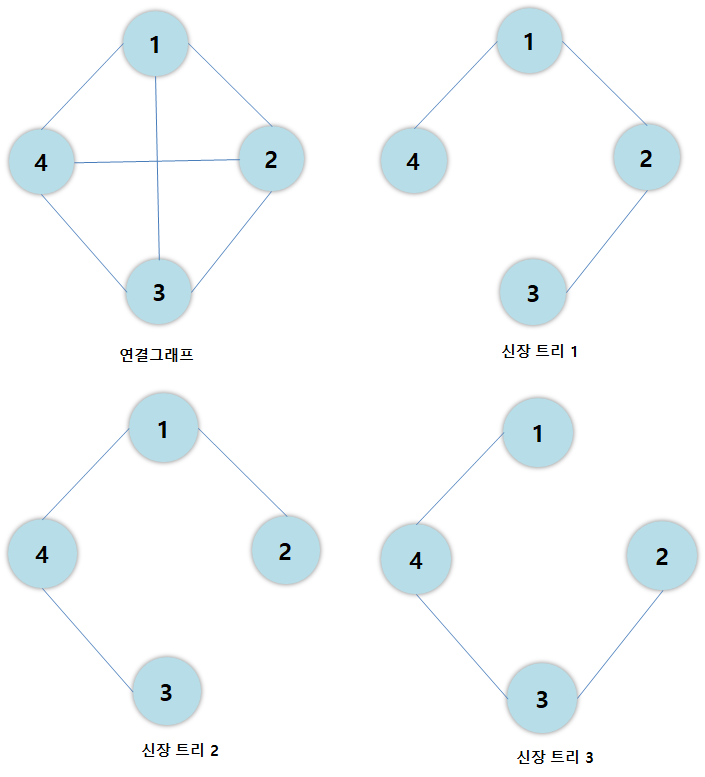
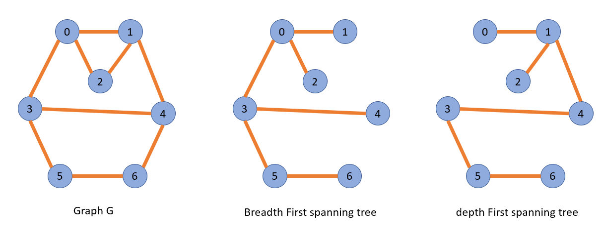

## 신장 트리<sup>spanning tree</sup>

> N개의 정점으로 이루어진 무방향 그래프 G에서 **N개의 모든 정점**과 **N-1개의 간선**으로 만들어진 트리

<p align="center">

</p>

<br>

<h3> 깊이 우선 신장 트리<sup>depth first spanning tree</sup></h3>

- 깊이 우선 탐색을 이용하여 생성된 신장 트리

<h3>너비 우선 신장 트리<sup>breadth first spanning tree</sup></h3>

- 너비 우선 탐색을 이용하여 생성된 신장 트리


<p align="center">

</p>

<br>

## 최소 비용 신장 트리<sup>minimum cost spanning tree</sup>

> 무방향 가중치 그래프에서 신장 트리를 구성하는 간선들의 가중치 합이 최소인 신장 트리
    
- 가중치 그래프의 간선에 주어진 가중치 = 비용이나 거리, 시간을 의미하는 값

<br>


<h3>크루스칼 알고리즘 1</h3>

- **가중치가 높은 간선을 제거**하면서 최소 비용 신장 트리를 만드는 방법
- 크루스칼 알고리즘 1의 절차
    1. 그래프 G의 모든 간선을 가중치에 따라 **내림차순**으로 정렬한다.
    2. 그래프 G에서 가중치가 가장 높은 간선을 제거한다. 단, 이때 정점을 그래프에서 분리시키는 간선<sub>신장 트리의 조건을 위배</sub>을 제거할 수 없으므로 이런 경우에는 그 다음으로 가중치가 높은 간선을 제거한다.
    3. 그래프 G에 간선에 N-1개 남을 때까지 2를 반복한다.
    4. 그래프에 간선이 N-1개만 남으면 최소 비용 신장 트리가 완성된다.

<br>

<h3> 크루스칼 알고리즘 2 </h3>

- **가중치가 낮은 간선을 삽입하면서** 최소 비용 신장 트리를 만드는 방법
- 크루스칼 알고리즘 2의 절차
    1. 그래프 G의 모든 간선을 가중치에 따라 오름차순으로 정리한다. 
    2. 그래프 G에 가중치가 가장 낮은 간선을 삽입한다. 단, 이때 사이클을 형성하는 간선을 삽입할 수 없으므로 그 다음으로 가중치가 낮은 간선을 삽입한다.
    3. 그래프 G에 간선이 N-1개가 될 때까지 2를 반복한다.
    4. 그래프 G의 간선이 N-1개가 되면 최소 비용 신장 트리가 완성된다.

<br>

<h3>프림 알고리즘</h3>

- 간선을 정렬하지 않고 하나의 정점에서 시작하여 트리를 확장해 나가는 방법
- 프림 알고리즘의 절차
  1. 그래프 G에서 시작 정점을 선택한다.
  2. 선택한 정점에 부속된 모든 간선 중에서 가중치가 가장 낮은 간선을 연결하여 트리를 확장한다.
  3. 이전에 선택한 정점과 새로 확장된 정점에 부속된 모든 간선 중에서 가중치가 가장 낮은 간선을 삽입한다. 단, 사이클을 형성하는 간선을 삽입할 수 없으므로 이런 경우에는 그 다음으로 가중치가 낮은 간선을 선택한다.
  4. 그래프 G에 간선이 N-1개 삽입될 때까지 3을 반복한다.
  5. 그래프 G의 간선이 N-1개가 되면 최소 비용 신장 트리가 완성된다.


<br>

## 최단 경로 <sup> Shortest Path</sup>

> 신장 트리가 아닌 가중치 그래프, 즉 네트워크<sup>Network</sup>에서 정점 u와 정점 v를 연결하는 경로 중에서 가중치의 합이 최소인 경로


<br>
<h3> 가중치 인접 행렬 <sup> Weight Adjacent Matrix</sup></h3>

- 최단 경로를 구하려는 가중치 그래프의 가중치를 저장   
  - 그래프에서 사용한 인접 행렬과 같은 형태의 2차원 배열
  - 두 정점 사이에 **간선이 없으면** 0이 아니라 **∞(무한대)값**이 저장되어 있다고 가정한다.
- 각 정점은 가지 자신과 이어진 간선을 허용하지 않으므로 가중치 인접 행렬에서 대각선 값은 0이다.


<br>

<h3> 다익스트라<sup>Dijkstra</sup> 최단 경로 알고리즘</h3>

- 하나의 시작 정점에서 다른 모든 정점까지 최단 경로를 구한다.
- 단일점에서의 최단 경로<sup>One to All Shortest Path</sup>알고리즘 중 가장 많이 사용
- 무방향 그래프, 방향 그래프 모두 적용 가능하다.
- 다익스트라 최단 경로 알고리즘의 절차
    1. 경로 길이를 저장할 배열 distance 준비    
        - 시작 정점으로부터 각 정점에 이르는 경로의 길이를 저장하기 위한 배열 distance를  ∞(무한대)로 초기화한다.
   2. 시작 정점 초기화
      - 시작 정점의 distance를 0으로 초기화하고 집합 S에 추가한다.
  2. 최단 거리 수정
      - 집합 S에 속하지 않은 정점 중에서 distance가 최소인 정점 u를 찾아 집합 S에 추가한다. 새로운 정점 u가 추가되면, u에 인접하고 집합 S에 포함되지 않은 정점 w의 distance값을 다음 식에 따라 수정한다. 집합 S에 모든 정점이 추가될 때까지 3을 반복한다.
  ```
  distance[w] = min(distance[w], distance[u]+weight[u][w])
  ```

- 시작 정점 v에서 정점 u까지의 최단 경로 distance[u]를 구하고, 정점 u를 집합 S에 추가함.
- 새로 추가된 정점 u에 의해 단축되는 경로가 있느지를 확인함
- 즉, 현재 알고 있는 distance[w]와 새로 추가된 정점 u를 거쳐서 가는 distance[u]+weight[u][w]를 계산한 경로를 비교하여 경로가 단축되면 distance[w]를 단축된 경로값으로 수정함으로써 최단 경로를 찾는다. 

<br>

<h3> 플로이드<sup>Floyd</sup> 최단 경로 알고리즘</h3>
  
- 모든 정점 사이의 최단 경로<sup>All to All Shortest Path</sup>를 구한 것
- k-최단경로 : 플로이드 최단 경로 알고리즘으로 만든 최단경로

