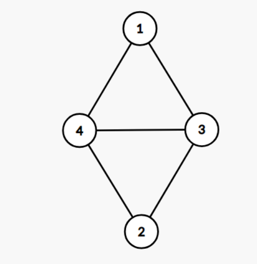
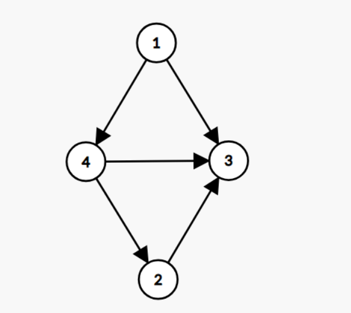
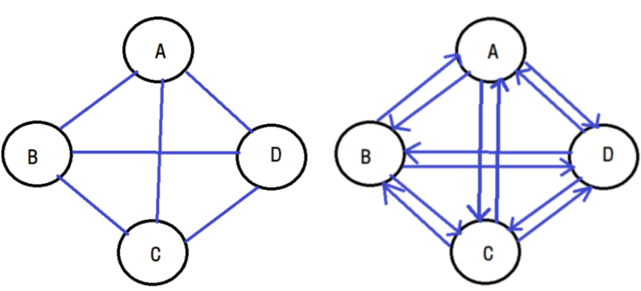
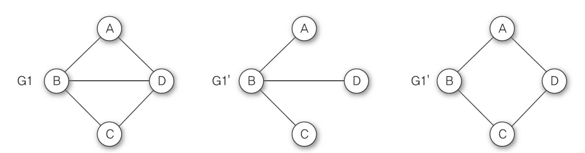
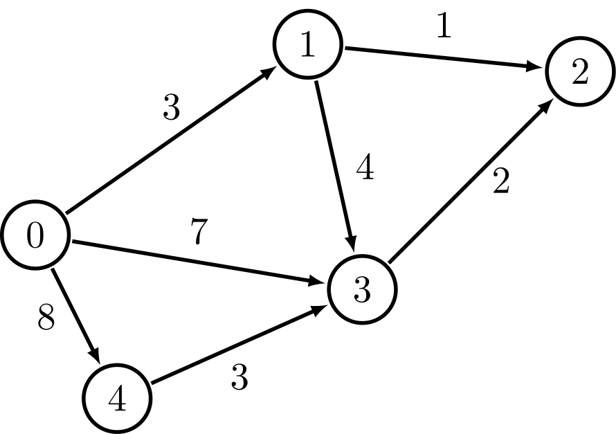
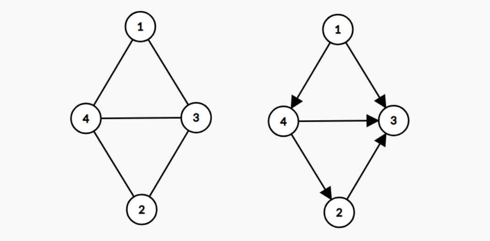
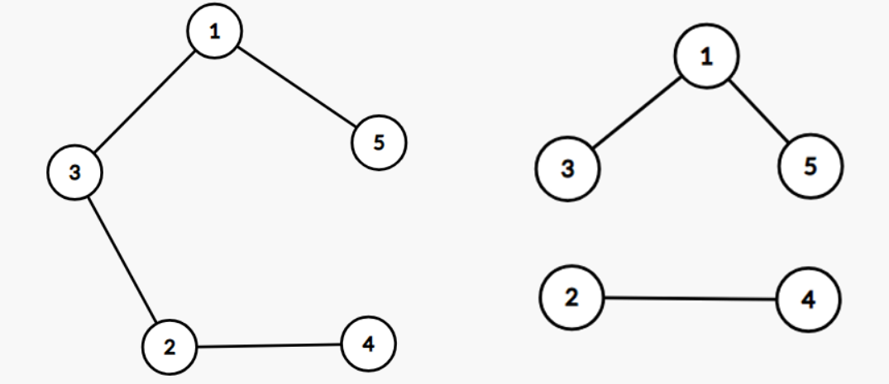

## 그래프
> 연결되어 있는 원소 사이의 다:다 관계를 표현하는 비선형 자료구조.

그래프  G는 객체를 나타내는 정점<sup>vertex</sup>과 객체를 연결하는 간선<sup>edge</sup>의 집합이다. 
<br>
- G = (V, E)
    - V는 그래프에 있는 정점들의 집합
    - E는 정점을 연결하는 간선들의 집합


## 그래프의 종류


<h3>무방향 그래프<sup>undirected graph</sup></h3>

- 두 정점을 연결하는 간선에 방향이 없는 그래프
- 정점 V<sub>i</sub>와 정점 V<sub>j</sub>을 연결하는 간선을 (V<sub>i</sub>, V<sub>j</sub>)로 표현
- (V<sub>i</sub>, V<sub>j</sub>)와 (V<sub>j</sub>, V<sub>i</sub>)는 같은 간선을 의미한다.

<p align="center">

</p>

```
V(G) = {1, 2, 3, 4}
E(G) = {(1, 3), (1, 4), (4, 2), (4, 3), (2, 3)}
```

<br>

<h3>방향 그래프<sup>directed graph</sup>, 다이그래프<sup>digraph</sup></h3>

- 간선에 방향이 있는 그래프
- 정점 V<sub>i</sub>에서 정점 V<sub>j</sub>를 연결하는 간선 즉, <b> V<sub>i</sub> -> V<sub>j</sub>를 <V<sub>i</sub>, V<sub>j</sub>></b>로 표현
    - V<sub>i</sub>를 꼬리(tail), V<sub>j</sub>를 머리(head)라고 한다.
    - <V<sub>i</sub>, V<sub>j</sub>>와 <V<sub>j</sub>, V<sub>i</sub>>는 서로 다른 간선을 의미한다.

<p align="center">

</p>

```
E(G) = {1, 2, 3, 4}
E(G) = {<1, 4>, <1, 3>, <4, 2>, <4, 3>, <2, 3>}
```

<br>

<h3>완전 그래프<sup>complete graph</sup></h3>  

- 각 정점에서 다른 모든 정점을 연결하여 최대로 많은 간선 수를 가진 그래프
- 정점이 n개인 무방향 그래프에서 최대 간선의 수 :`n(n-1)/2`개
- 정점이 n개인 방향 그래프의 최대 간선 수 : `n(n-1)`개




<br>

<h3>부분 그래프<sup>subgraph</sup></h3>

- 원래의 그래프에서 정점이나 간선을 일부만 제외하여 만든 그래프
- 그래프 G와 부분그래프 G'의 관계
- V(G') ${\displaystyle \subseteq }$ V(G), E(G') ${\displaystyle \subseteq }$ E(G)



<br>

<h3>가중 그래프<sup>weight graph</sup>, 네트워크<sup>network</sup></h3>
  
- 정점을 연결하는 간선에 가중치<sup>weight</sup>를 할당한 그래프

<p align="center">

</p>


<br>

## 그래프 용어

<p align="center">

</p>

- 그래프에서 두 정점 V<sub>i</sub>과 V<sub>j</sub>를 연결하는 간선 (V<sub>i</sub>, V<sub>j</sub>)가 있을 때,두 정점 V<sub>i</sub>와 V<sub>j</sub>를 <b>인접<sup>adjacent</sup></b>되어 있다고 하고, 간선 (V<sub>i</sub>, V<sub>j</sub>)는 정점 V<sub>i</sub>와 V<sub>j</sub>에 <b>부속<sup>incident</sup></b>되어 있다고 한다.


<br>

<h3>차수<sup>degree</sup></h3>

- 정점에 부속되어있는 간선의 수
- 방향 그래프의 정점의 차수 = `진입차수 + 진출차수`
  - 방향 그래프의 <b>진입차수(in-degree)</b> = 정점을 머리로 하는 간선의 수
  - 방향 그래프의 <b>진출차수(out-degree)</b> = 정점을 꼬리로 하는 간선의 수
    - 위 그림에서 방향 그래프 정점 4의 진입차수는 1, 진출차수는 2이므로 전체 차수는 3이다.

<br>

<h3>경로<sup>path</sup></h3>

- 그래프에서 간선을 따라 갈 수 있는 길을 순서대로 나열한 것. 즉, 정점 V<sub>i</sub>에서 V<sub>j</sub>까지 간선으로 연결된 정점을 순서대로 나열한 리스트
- 위 그림에서 무방향 그래프의 정점 1에서 정점 2까지는 1-4-2 경로와 1-4-3-2 경로, 1-3-2경로, 1-3-4-2 경로가 있다.
  - <b>경로길이<sup>path length</sup></b> = 경로를 구성하는 간선의 수
  - <b>단순경로<sup>simple path</sup></b> = 모두 다른 정점으로 구성된 경로


<br>

<h3>사이클<sup>cycle</sup></h3>

- <b>단순경로 중</b>에서 경로의 시작 정점과 마지막 정점이 같은 경로
- 시작 정점과 끝 정점을 제외한 나머지 정점들은 중복되지 않아야 한다.
  - 위 그림에서 무방향 그래프의 단순경로 1-4-2-3-1는 사이클이 된다.

<br>

<h3>DAG<sup>directed acyclic graph</sup></h3>

- 방향 그래프이면서 사이클이 없는 그래프


<br>

<h3>연결 그래프<sup>connected graph</sup></h3>

- 서로 다른 모든 쌍의 정점들 사이에 경로가 있는 그래프 즉, 떨어져 있는 정점이 없는 그래프
- 그래프에서 두 정점 V<sub>i</sub>에서 V<sub>j</sub>까지의 경로가 있으면 정점 V<sub>i</sub>와 V<sub>j</sub>가 <b>연결<sup>connected</sup></b>되어있다고 한다.
  - 따라서 <b><i>트리는 사이들이 없는 연결 그래프</i></b>라 할 수 있다.
- <b>단절 그래프<sup>disconnectedGraph</sup></b> = 연결되지 않은 정점이 있는 그래프

<p align="center">

</p>

