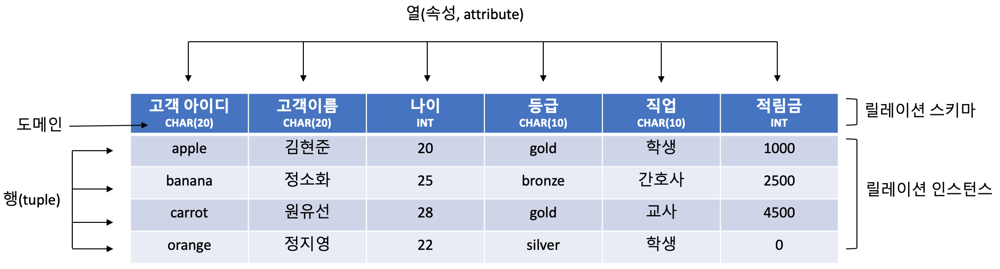
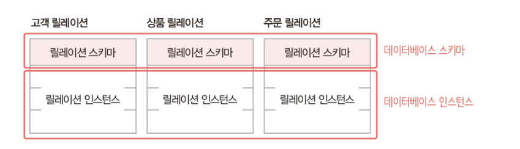

## ER Modeling Essentials

### 1. 개체(Entity) 

**개체 타입 (Entity Type)**
  > 개체 타입은 개체를 고유한 이름과 속성들로 정의한 것으로, 파일 구조의 레코드 타입에 대응된다.

   

**개체 인스턴스 (Entity Instance)**
  > 개체 인스턴스는 개체를 구성하는 속성이 실제 값을 가지며 실체화된 개체이다.  
  (개체 어커런스라고도 하며, 파일 구조의 레코드 인스턴스와 대응된다.)

 

**개체 집합 (Entity Set)**
  > 동일한 개체 타입에 속하는 모든 개체 인스턴스들의 모임을 말한다.

   

 **키 속성 (Key Attribute)**:  
  각 개체 인스턴스를 식별하는 데 사용되는 속성으로, 모든 개체 인스턴스의 키 값은 서로 달라야 한다.  
  (하나 이상의 속성으로 구성될 수 있으며, ER 다이어그램에서는 보통 밑줄로 표현된다.)

 

**약한 개체와 강한 개체 (Weak and Strong Entities)**
- **강한 개체 (Strong Entity)**:  
  독립적으로 존재하며, 다른 개체의 존재 여부에 의존하지 않는 개체.
- **약한 개체 (Weak Entity)**:  
  다른 개체(주로 강한 개체)에 의존하여 존재하는 개체로, 반드시 강한 개체와의 관계에 참여해야 한다.
  - **특징**:
    - 약한 개체는 자체적으로 완전한 식별 키를 가지지 못하며, 강한 개체의 키를 포함하여 식별된다.
    - 강한 개체와 약한 개체 간의 관계는 일반적으로 일대다 관계로 나타난다.

 

 

### 2. 관계 (Relationship)
 > 개체와 개체 간의 연관성을 나타내며, 개체 집합들 사이의 대응 관계(매핑)를 의미한다.  

  (ER 다이어그램에서는 마름모로 표현된다.)

#### 아리티 (Arity) 
 > 관계에 참여하는 개체 집합의 **수**를 의미한다.
- **종류**:
  - **이항 관계 (Binary Relationship)**:  
    두 개의 개체 집합 사이의 관계.
  - **삼항 관계 (Ternary Relationship)**:  
    세 개의 개체 집합 사이의 관계.
  - **순환 관계 (Recursive Relationship)**:  
    한 개체 집합 내에서 자기 자신과 맺는 관계.

 

#### 카디널리티 (Cardinality)
  >관계 내에서 각 개체 인스턴스가 **몇 개의 다른 인스턴스와 연결될 수 있는지**를 나타낸다.
- **종류**:
  - **1:1 관계 (One-to-One)**:  
    한쪽 개체의 각 인스턴스가 상대 개체의 단 하나의 인스턴스와 연결된다.
  - **1:N 관계 (One-to-Many)**:  
    한쪽 인스턴스가 여러 인스턴스와 연결되지만, 반대쪽은 단 하나로 연결된다.
  - **N:N 관계 (Many-to-Many)**:  
    양쪽 모두 여러 인스턴스와 연결될 수 있다.

 

 

### 3. 관계 데이터 모델의 개념
- **관계 데이터 모델**:  
  현실 세계의 개체들을 논리적 구조로 표현하는 모델로,  
  하나의 개체에 관한 데이터를 하나의 테이블(릴레이션)로 표현한다.

#### 용어
- **속성**:  
  개체나 릴레이션이 가지는 특성 또는 데이터를 의미한다.
  
- **투플**:  
  릴레이션 내의 하나의 행(row)이다.

- **도메인**:  
  속성이 가질 수 있는 값들의 집합이다.

- **널 값**:  
  값이 존재하지 않음을 나타내는 특수한 값이다. 

- **차수**:  
  릴레이션이 가지는 속성의 수이다. 

- **카디널리티**:  
  릴레이션에 존재하는 투플(행)의 수를 의미한다.

    

 

 

### 4. 릴레이션과 데이터베이스의 구성
- **릴레이션 스키마 (Relation Schema)**:  
  - 릴레이션(테이블)의 논리적 구조를 정의하는 것으로,  
  - **릴레이션의 이름**과 **릴레이션에 포함된 모든 속성(attribute)들의 이름**으로 구성된다.  
  - 스키마는 주로 정적인 특성을 가지며 자주 변하지 않는다.

- **릴레이션 인스턴스 (Relation Instance)**:  
  - 특정 시점에 릴레이션에 존재하는 튜플(레코드)들의 집합이다.  
  - 데이터의 삽입, 삭제, 수정 등의 작업에 따라 인스턴스는 계속 변한다.

- **데이터베이스와 릴레이션**:  
  - 일반적으로 데이터베이스는 릴레이션 여러 개로 구성된다.  

  
 

 

### 5. 릴레이션의 특징
- **중복 없음**:  
  한 릴레이션에는 동일한 튜플이 존재할 수 없다  
  (집합의 개념처럼, (a, a, b)는 (a, b)와 동일하여 중복을 허용하지 않음).
  
- **튜플 순서 무의미**:  
  릴레이션 내에서 튜플의 순서는 중요하지 않다.
  
- **속성 순서 무의미**:  
  릴레이션 내에서 속성(열)들의 순서도 의미가 없다.
  
- **속성의 원자성**:  
  각 속성은 더 이상 분해할 수 없는 **원자적** 값이어야 한다.

 

 

### 6. 키 (Key) 개념
- **키**:  
  릴레이션 내의 튜플들을 유일하게 구별하기 위한 하나 이상의 속성들의 집합.

#### 키의 특성
- **유일성 (Uniqueness)**:  
  모든 튜플은 서로 다른 키 값을 가져야 한다.
- **최소성 (Minimality)**:  
  키는 꼭 필요한 최소한의 속성들로 구성되어야 한다.

#### 주요 키 종류
- **슈퍼키 (Super Key)**:  
  유일성을 만족하는 속성 또는 속성들의 집합.
  
- **후보키 (Candidate Key)**:  
  유일성과 최소성을 모두 만족하는 속성 또는 속성들의 집합.
  
- **기본키 (Primary Key)**:  
  후보키 중 기본적으로 선택된 키.  
  (널 값을 포함하는 후보키는 기본키로 부적합하다.)
  
- **대체키 (Alternate Key)**:  
  기본키로 선택되지 않은 후보키들.
  
- **외래키 (Foreign Key)**:  
  다른 릴레이션의 기본키를 참조하는 속성 또는 속성들의 집합으로,  
  릴레이션 간의 관계를 표현한다.
  - **참조하는 릴레이션**: 외래키를 가진 릴레이션.
  - **참조되는 릴레이션**: 외래키가 참조하는 기본키를 가진 릴레이션.
