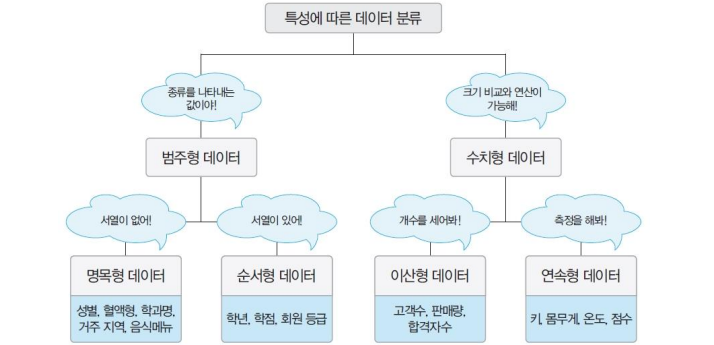

## Database and DBMS Explained

### 1. 데이터와 정보
- **데이터 (Data)**
  - 현실 시계에서 관찰하거나 측정하여 수집한 사실이나 값.
- **정보 (Information)**
  - 데이터를 가공, 처리하여 의사 결정에 유용하게 활용할 수 있도록 만든 결과물.

 

 

### 2. 데이터베이스(Database)란?

> 데이터베이스는 조직 내에서 수집, 저장, 관리되는 **구조화된 데이터 집합**이다. 

 **핵심 개념**
  - **공유 데이터** shared data
    - 특정 조직 내 여러 사용자가 함께 소유하고 이용할 수 있는 공용 데이터이다.
  - **통합 데이터** integrated data
    - 최소한의 중복만 허용하며, 통제 가능한 중복 상태로 관리되는 데이터.
  - **저장 데이터** stored data
    - 컴퓨터가 접근할 수 있는 매체(하드디스크, SSD 등)에 저장된 데이터.
  - **운영 데이터** operational data
    - 조직의 주요 기능을 수행하기 위해 지속적으로 필요한 데이터를 의미함.

 

**데이터베이스의 특징**
- **실시간 접근** real-time accessibility
  - 사용자의 요구에 실시간으로 응답할 수 있는 데이터.
- **계속 변화** continuous evolution
  - 데이터의 지속적인 삽입, 삭제, 수정으로 항상 최신 상태를 유지.
- **동시 공유** concurrent sharing
  - 여러 사용자 혹은 응용 프로그램이 동시에 접근하여 사용할 수 있음.
- **내용 기반 참조** content reference
  - 데이터의 저장 위치가 아닌, 내용 자체를 기반으로 참조가 가능함.

 

 

### 3. 데이터 분류

**형태**에 따른 분류
- **정형 데이터 (Structured Data)**
  - 미리 정의된 구조(예: 테이블, 스키마)에 따라 저장된 데이터.
- **반정형 데이터 (Semi-structured Data)**
  - 일정한 구조를 가지지만, 데이터 내용 안에 구조에 대한 설명이 함께 존재하는 데이터 (예: XML, JSON).
- **비정형 데이터 (Unstructured Data)**
  - 정해진 구조 없이 저장된 데이터 (예: 이미지, 영상, 자연어 텍스트).

 

**특성**에 따른 분류

  

---

### 4. 파일 시스템과 DBMS
#### **파일 시스템**
> 데이터를 파일로 관리하기 위해 생성, 삭제, 수정, 검색 기능을 제공하는 소프트웨어.
- **문제점:**
  - 같은 내용의 데이터가 여러 파일에 중복 저장됨.
  - 응용 프로그램이 데이터 파일에 종속됨.
  - 동시 공유, 보안, 백업 및 복구 기능이 부족하여 관리에 어려움이 있음.
  - 응용 프로그램 개발 및 유지 보수가 복잡함.

#### **데이터베이스 관리 시스템(DBMS)**
> 파일 시스템의 데이터 중복과 데이터 종속 문제를 해결하기 위해 제시된 소프트웨어.
- **주요 목표:**
  - 조직에 필요한 데이터를 중앙집중식으로 통합하여 저장 및 관리.
  - 데이터 중복을 통제하고, 데이터 독립성을 확보하며, 효율적인 동시 공유 및 보안을 제공.

 

 

### 5. DBMS의 장단점

**장점**
- **데이터 중복 통제**
  - 데이터를 통합 관리하여 중복 저장 문제를 해결.
- **데이터 독립성 확보**
  - 응용 프로그램과 데이터베이스 사이에 명확한 분리로, 데이터 변경 시 응용 프로그램 수정 부담 감소.
- **동시 공유 지원**
  - 여러 응용 프로그램이 동일 데이터를 동시에 사용할 수 있게 지원.
- **데이터 보안 향상**
  - 중앙집중식 데이터 관리로 효율적인 접근 제어 및 보안 강화.
- **데이터 무결성 유지**
  - 데이터 삽입, 수정 시 유효성 검사로 데이터의 정확성과 일관성 보장.
- **표준화된 접근**
  - DBMS가 정한 표준 인터페이스를 통해 데이터에 접근, 관리가 용이.
- **백업 및 회복 기능**
  - 장애 발생 시 데이터의 일관성과 무결성을 유지하면서 복구 가능.
- **응용 프로그램 개발 비용 절감**
  - 파일 시스템에 비해 데이터 관리 부담이 줄어들어 개발 및 유지 보수 비용 절감.

 

**단점**
- **비용 문제**
  - DBMS 소프트웨어 및 하드웨어 구매 비용이 높고, 사용자의 수에 따라 비용이 증가할 수 있음.
- **백업과 회복의 복잡성**
  - 시스템 장애 시 원인 파악 및 회복 방법이 복잡할 수 있음.
    - 다만, 이는 파일 시스템도 동일하다.
- **중앙 집중 관리의 취약점**
  - 중앙 집중식 관리 방식으로 인해 DBMS 장애가 발생하면 전체 시스템 업무가 중단될 위험 있음.
- **높은 데이터베이스 의존도**
  - 시스템이 DBMS에 크게 의존할수록 가용성과 신뢰성에 치명적인 영향을 미칠 수 있음.

 

 

### 6. DBMS 발전 과정 
DBMS는 기술 발전과 함께 여러 세대를 거치며 발전해 왔다.

#### **1세대 DBMS (1960년대)**
- **특징**:  
  - **네트워크 및 계층형 모델** 기반.
  - 데이터와 응용 프로그램이 밀접하게 결합되어 있음.
  - 사용이 제한적이고, 사용자 친화성이 낮음.
- **예시**:  
  - IMS (Information Management System)

#### **2세대 DBMS (1970년대)**
- **특징**:  
  - **관계형 데이터베이스 (RDBMS)** 개념 도입.
  - SQL(Structured Query Language)을 통한 데이터 질의가 가능해짐.
  - 데이터 독립성과 응용 프로그램의 분리 향상.
- **예시**:  
  - IBM의 System R, Oracle, Ingres

#### **3세대 DBMS (1980~1990년대)**
- **특징**:  
  - **객체 지향 데이터베이스** 및 **하이브리드 DBMS** 등장.
  - 데이터베이스 확장성, 분산 처리, 트랜잭션 관리 기능 강화.
  - 고성능, 대용량 데이터 처리에 중점.
- **예시**:  
  - Sybase, Informix, Microsoft SQL Server

#### **4세대 DBMS (2000년대 이후)**
- **특징**:  
  - **NoSQL, NewSQL** 등 비관계형 데이터베이스 등장.
  - 빅데이터, 클라우드 컴퓨팅 환경에 최적화.
  - 비정형 데이터를 저장하고 처리하는 데 적합.
  - 데이터 모델 다양화 (문서, 그래프, 키-값 저장소 등).
  - 높은 확장성과 유연성을 제공하며, 실시간 데이터 처리 지원.
- **예시**:  
  - MongoDB, Cassandra, Redis, Google Spanner

