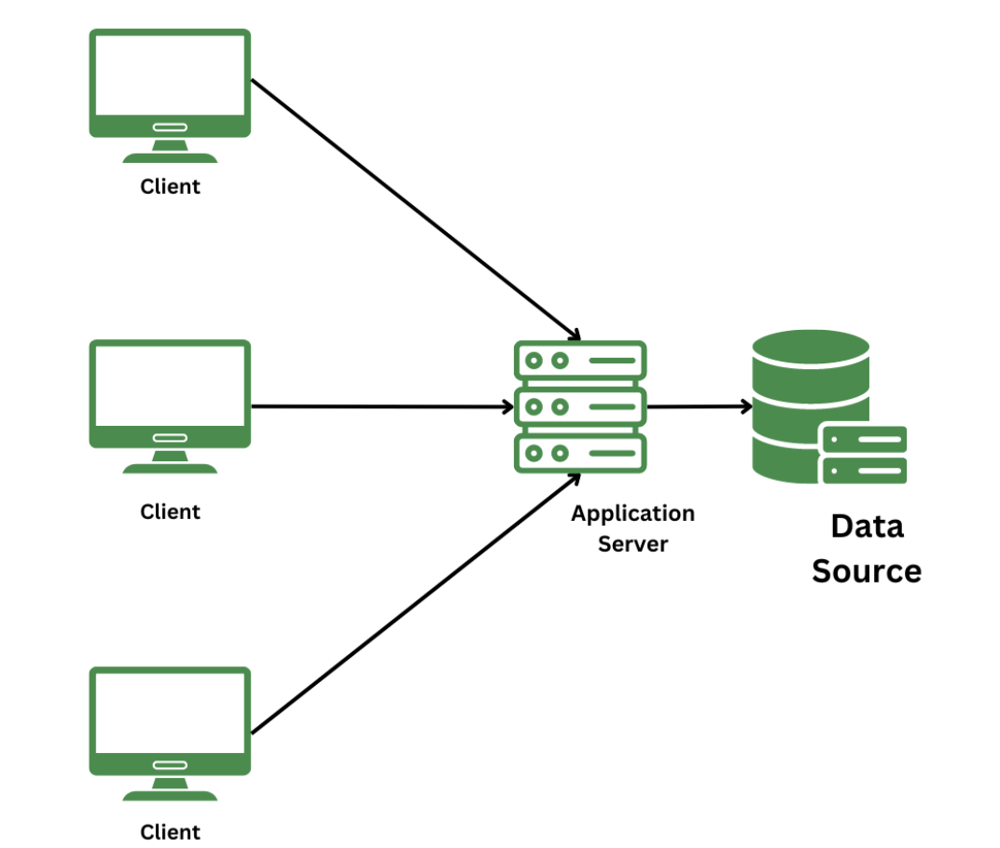

## 3계층 구조

### 개요

3계층 구조(3-Tier Architecture)는 소프트웨어애플리케이션을 세 개의 논리적 및 물리적 컴퓨팅 계층으로 나누는 아키텍처 패턴이다. 각 계층은 독립적으로 기능하며 주로 프레젠테이션(Presentation), 애플리케이션(Application), 데이터(Data) 계층으로 나뉜다. 이 구조는 관심사의 분리를 실현하여 소프트웨어의 복잡성을 줄이고 유지보수 및 관리 효율성을 높여준다.

### 3계층의 구성

1. **프레젠테이션 계층 (Presentation Layer)**
    - 사용자와 직접 상호작용하는 최상위 클라이언트 계층이다. 사용자 인터페이스(UI)를 제공하고, 사용자의 입력을 받아 애플리케이션 계층으로 전달하며, 처리된 결과를 화면에 보여준다.
    - 데이터 처리나 비즈니스 로직은 포함하지 않으며, 오직 화면 표시와 UI/UX 처리만 담당한다.
    - e.g., 웹 브라우저, 모바일 앱, 데스크톱 애플리케이션 등이 프레젠테이션 계층에 해당한다.

2. **애플리케이션 계층 (Application Layer)**
    - 비즈니스 로직과 애플리케이션의 핵심 기능을 처리하는 중간 계층이다. 프레젠테이션 계층에서 전달받은 요청을 분석하고, 필요한 연산이나 규칙을 적용하며, 데이터 계층과 통신하여 데이터를 읽거나 쓴다.
    - 클라이언트와 데이터베이스 사이의 미들웨어(Middleware)로 동작한다. 보안 검사, 트랜잭션 처리 등 핵심 기능을 여기서 담당한다.
    - e.g., Spring Boot, Django, Node.js 등이 애플리케이션 계층에 해당한다.

3. **데이터 계층 (Data Layer)**
    - 애플리케이션의 모든 데이터를 영구적으로 저장하고 관리하는 최하위 계층이다. 애플리케이션 계층의 요청(쿼리)에 따라 데이터를 삽입, 조회, 수정 삭제(CRUD)한다.
    - 데이터베이스 관리 시스템(DBMS)이 이 역할을 수행하며, 데이터의 무결성, 동시성 제어, 백업 등을 책임진다.
    - e.g., MySQL, PostgreSQL, MongoDB 등이 데이터 계층에 해당한다.

### 장점
- **유지보수성 향상** : 각 계층이 독립적이므로 특정 계층(예: UI 디자인 변경)을 수정하더라도 다른 계층(예: DB 구조나 서버 로직)에 영향을 주지 않는다. 코드가 체계적으로 분리되어 있어 버그 추적과 디버깅이 용이하다.

- **확장성 (Scalability)**: 시스템에 트래픽이 몰릴 때 전체를 늘릴 필요 없이 부하가 걸리는 특정 계층만 개별적으로 확장(Scale-out)할 수 있다. 예를 들어, 연산이 많으면 WAS(애플리케이션 서버)만 증설하고, 데이터가 많으면 DB 서버만 분산시킬 수 있다.

- **보안성 강화**: 클라이언트(사용자)가 데이터베이스에 직접 접근할 수 없도록 애플리케이션 계층이 중간에서 방화벽 역할을 수행한다. 비인가 접근 차단이나 SQL 인젝션 방어 등 보안 로직을 애플리케이션 계층에 중앙 집중화하여 적용할 수 있다.

- **유연한 협업**: 실제 소프트웨어 프로젝트를 진행할 때, 프론트엔드와 백엔드 개발자가 API 명세서만 합의하면 각자의 계층에서 독립적이고 병렬적으로 개발을 수행할 수 있어 업무 효율이 크게 높아진다.